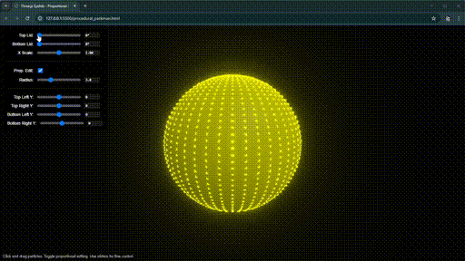

# procedural-sims
Procedurally created geometries in Three.js generated via LLM prompting.

- Clone the repository and run any HTML file with Live Server to test it out.
- If you have issues check Dev Tools and look for errors. Use ChatGPT, Gemini, or Grok to help resolve the problem.

**PROCEDURAL_PACMAN.HTML:** This could represent PAC-MAN, an eye, a mouth, etc. Control the top and bottom lid roation, scale the radius on the X axis, control the corners of the mouth, and drag and drop the verties with proportional edits.  

**If you get value from this repository follow me on X [@renderfiction](https://x.com/renderfiction)**

